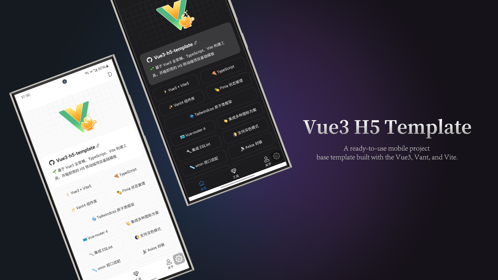
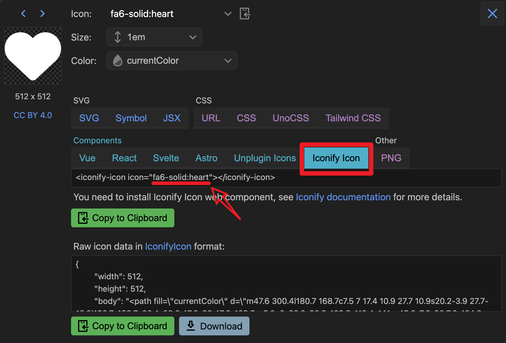
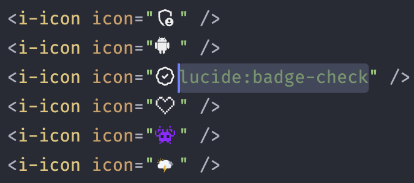
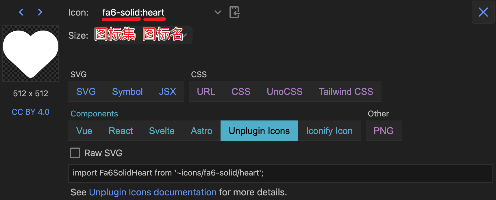
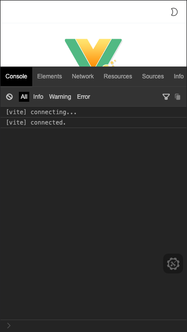

<div align="center">
	
</div>


<h1 align="center">Vue3 H5 Template</h1>

**🌱 基于 Vue3 全家桶、TS/JS、Vite 构建工具，开箱即用的移动端项目基础模板**

- [x] ⚡ Vue3 + Vite5
- [x] 🍕 TypeScript
- [x] ✨ Vant4 组件库
- [x] 🌀 Tailwindcss 原子类框架
- [x] 👏 集成多种图标方案
- [x] 🍍 Pinia 状态管理
- [x] 🌓 支持深色模式
- [x] 🧀 支持 i18n
- [x] Vue-router 4
- [x] vmin 视口适配
- [x] Axios 封装
- [x] 打包资源 gzip 压缩
- [x] 开发环境支持 Mock 数据
- [x] ESLint
- [x] 首屏加载动画
- [x] 开发环境调试面板
- [x] 生产环境 CDN 依赖

**如有 i18n 国际化多语言需求，请切换到 [i18n](https://github.com/yulimchen/vue3-h5-template/tree/i18n) 分支**

**主分支默认 TypeScript，如果你希望使用的是 JavaScript 语言，请切换 [js-version](https://github.com/yulimchen/vue3-h5-template/tree/js-version) 分支进行开发**


## 运行项目

注意：要求 Node 版本 18+，可使用 [nvm](https://github.com/nvm-sh/nvm#installing-and-updating) 进行本地 Node 版本管理，同时建议使用 [pnpm](https://pnpm.io/zh/installation) 包管理器。

```shell
# 克隆项目
git clone https://github.com/yulimchen/vue3-h5-template.git

# 进入项目目录
cd vue3-h5-template

# 安装依赖
pnpm install

# 启动服务
pnpm dev
```


## 文档引导

> - [按需引入 vant 组件](#vant)
> - [图标使用](#icon)
> - [路由缓存 & 命名注意 ⚠](#router)
> - [调试面板 eruda](#console)
> - [动态设置页面标题](#page-title)
> - [vw 视口适配](#viewport)
> - [Tailwindcss 原子类框架](#tailwindcss)
> - [Git 提交信息规范](#git)
> - [CDN 加载依赖](#CDN)


### <span id="vant">按需引入 vant 组件</span>

全量引入组件库太过臃肿，项目中使用 `unplugin-vue-components` 插件进行按需自动引入组件，可通过[官方文档](https://vant-ui.github.io/vant/#/zh-CN/quickstart#2.-pei-zhi-cha-jian)了解更多。


### <span id="icon">图标使用</span>

① **Iconify 图标（推荐）**

Iconify 拥有图标数量超过 20 万的图标库，同时文档比较友好，本项目基于 `Iconify for Vue` 稍微进行了封装。

使用方法 ⑴：



基于 Iconify [图标集网站](https://icon-sets.iconify.design/)获取到你想要的图标名称后填入 `i-icon` 组件的 `icon` 属性即可。

```vue
<i-icon icon="fa6-solid:heart" />
```

配合 VS Code [编辑器扩展](https://marketplace.visualstudio.com/items?itemName=antfu.iconify)可在编码时实时预览图标！



注意，方法 ⑴ 是通过 Iconify API 按需请求获取图标，如果你的项目仅在内网环境部署，可通过👇🏻方法 ⑵ 离线使用图标。

使用方法 ⑵ ：

基于 Iconify [图标集网站](https://icon-sets.iconify.design/)搜索到你想要的图标，安装图标对应的图标集依赖包。

```shell
pnpm i -D @iconify-icons/fa6-solid
```

*依赖包名规则：@iconify-icons/[图标集]*



引入你想要的图标 data，赋值给 `i-icon` 组件的 `icon` 属性即可。

*图标路径规则：@iconify-icons/[图标集]/[图标名]*

```ts
import Fa6SolidHeart from "@iconify-icons/fa6-solid/heart";
```

```vue
<i-icon :icon="Fa6SolidHeart" />
```

案例代码可参考本项目的 `tools` [页面](https://github.com/yulimchen/vue3-h5-template/blob/master/src/views/tools/index.vue)，想对强大的 Iconify 了解更多？请戳 👉 https://iconify.design/docs/


② 本地 SVG 文件图标


> 1. 将 svg 图标文件放在 `src/icons/svg` 目录下
> 2. 在项目中直接使用 `<svg-icon name="svg图标文件命名" />` 即可

例如：

本项目 `src/icons/svg` 中放了个叫 `check-in.svg` 的图标文件，然后在组件 `name` 属性中填入文件的命名即可，So easy~


```Vue
<svg-icon name="check-in" />
```

> 项目中使用了 `unplugin-vue-components` 自动引入组件，所以 `main.ts` 中无需注册全局图标组件。


### <span id="router">路由缓存 & 命名注意 ⚠</span>

组件默认开启缓存，如某个组件需关闭缓存，在对应路由 `meta` 内的 `noCache` 字段赋值为 `true` 即可。

```typescript
// src/router/routes.ts
const routes: Array<RouteRecordRaw> = [
    // ...
    {
        path: "about",
        name: "About",
        component: () => import("@/views/about/index.vue"),
        meta: {
            title: "关于",
            noCache: true
        }
    }
];
```

 为了保证页面能被正确缓存，请确保**组件**的 `name` 值和对应路由的 `name` 命名完全相同。

```vue
<!-- src/views/about/index.vue -->
<script setup lang="ts">
// Vue3.3+ defineOptions 宏
defineOptions({
  name: "About"
});
</script>

<template>
  <div>about</div>
</template>
```


### <span id="console">调试面板 eruda</span>



为了方便移动端查看 log 信息和调试，开发环境引入了 eruda 调试面板的 cdn。如果你的开发环境不需要的话请在 `.env.development` 中修改值

```html
# .env.development

# 开发环境启用 cdn eruda 调试工具。若不启用，将 true 修改为 false 或其他任意值即可
VITE_ENABLE_ERUDA = "true"
```


### <span id="page-title">动态设置页面标题</span>

在路由全局前置守卫中：

```js
// src/router/index.ts
// ...
router.beforeEach((to: toRouteType, from, next) => {
  // ...
  // 页面 title
  setPageTitle(to.meta.title);
  next();
});
```

具体实现方法见文件 `src/utils/set-page-title.ts` 。


